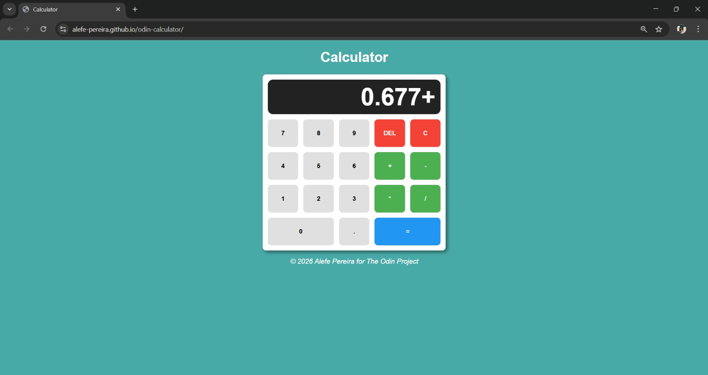

# 🧮 Calculator

> A fully functional browser calculator built with vanilla HTML, CSS, and JavaScript — no frameworks, no libraries.

<br>

## 🌐 Live Preview

🔗 **[Link Preview →](https://alefe-pereira.github.io/odin-calculator/)**

<br>

## 📸 Screenshot

 

<br>

## ✨ Features

- Basic arithmetic: **addition, subtraction, multiplication, division**
- **Decimal point** support with duplicate-dot prevention
- **Chained calculations** — operate on a result without pressing `=` first
- **Delete** (DEL) button removes the last digit/operator one step at a time
- **Clear** (C) button resets everything instantly
- **Division by zero** protection — displays `!error`
- Leading-zero prevention (no `007`-style numbers)
- Result precision up to 2 decimal places, with trailing zeros removed (`8.50 → 8.5`)

<br>

## 🗂️ Project Structure

```
calculator/
├── index.html    # Markup and button layout
├── style.css     # Grid layout, colors, and button styles
└── script.js     # All calculator logic
```

<br>

## 🧠 Technical Highlights

- **Rule-table pattern** — instead of chains of `if/else`, each button has a declarative array of `{ condition, action }` rules. The first matching condition wins, keeping the logic readable and easy to extend.
- **Centralized state object** — a single `object` holds `numOne`, `operand`, `numTwo`, and `product`, making the app state predictable at every step.
- **Chained operations** — pressing an operator after a result (`product`) automatically carries it forward as the new base number.
- **Arithmetic via higher-order functions** — the `arithmetic()` function receives the operation as a callback `(x, y) => x + y`, avoiding repeated boilerplate.
- **Smart formatting** — `toFixed(2).replace(/\.?0+$/, "")` trims unnecessary decimals from results.

<br>

## 🚀 Getting Started

No build step required:

```bash
git clone https://github.com/YOUR_USERNAME/calculator.git
open index.html
```

<br>

## 🕹️ How to Use

| Button | Action |
|--------|--------|
| `0–9` | Enter digits |
| `+ - * /` | Select operator |
| `.` | Add decimal point |
| `=` | Calculate result |
| `DEL` | Delete last digit or operator |
| `C` | Clear everything |

Chained calculations work naturally — after a result, just press an operator to keep going.

<br>

## 👤 Author

**Alefe Pereira** · © 2026 · [The Odin Project](https://www.theodinproject.com)